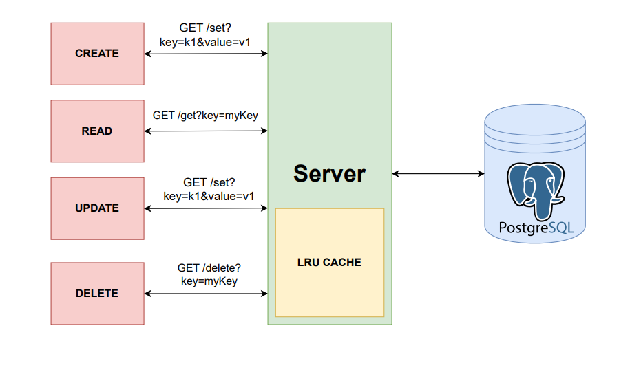

# High-Performance C++ Key-Value Store

This project implements a two-tier key-value store system written in C++. It separates the application logic into a fast, in-memory caching layer (Front-End) and a persistent database layer (Back-End).

GitHub Link : https://github.com/dev-69/DECS-Project-25M0824

Working :
1. Open three different terminals.
2. First in one terminal run ./backend then in another terminal run ./frontend .
3. Run ./client in the third terminal. This will act as your client side.

## System Architecture

The system operates on a two-tier model:

* **Tier 1: Front-End Server (Caching Layer)**
    * This is the public-facing server that clients interact with.
    * It listens on port **7000**.
    * It maintains a fixed-size **LRU (Least Recently Used) cache** in memory for extremely fast data access.
    * It uses a **thread pool** to handle many client connections concurrently.
    * It implements a **write-back** cache policy:
        * `SET` operations are written *only* to the in-memory cache and marked "dirty."
        * Data is only written to the Back-End database when an item is evicted from the cache or during a graceful shutdown.
    * It communicates with the Back-End Server using an internal HTTP-like API (e.g., `/db_get`, `/db_set`).

* **Tier 2: Back-End Server (Persistence Layer)**
    * This is the internal server responsible for data persistence.
    * It listens on port **7001** and accessible by the Front-End server.
    * It uses a **thread pool** to handle concurrent requests from the Front-End.
    * Each worker thread maintains its own connection to a **PostgreSQL** database.
    * It translates internal API calls (e.g., `/db_set`) into parameterized **SQL queries** (`INSERT`, `SELECT`, `DELETE`) to safely interact with the database.

### Data Flow for GET Request

1.  A client sends a `GET /get?key=mykey` request to the **Front-End Server** (port 7000).
2.  The Front-End checks its in-memory LRU cache.
3.  **Cache Hit:** : the key is found in the cache
    * the corresponding node is moved to the front of the LRU Doubly Linked List.
    * the value is returned to the client immediately. The request is complete.
4.  **Cache Miss:** If the key is not in the cache:
    * The Front-End server sends an internal `GET /db_get?key=mykey` request to the **Back-End Server** (port 7000).
    * A Back-End worker thread queries the PostgreSQL database: SELECT value FROM KV_Store WHERE key = $1
    * The Back-End returns the value (or a 404) to the Front-End.
    * The Front-End **adds the new key-value pair to its LRU cache** or evicts an old item if full.
    * The Front-End returns the value to the original client.

### Data Flow for Set Request

1.  A client sends a `SET /set?key=mykey&value=myvalue` request to the **Front-End Server** (port 7000).
2.  The Front-End checks its in-memory LRU cache.
3.  **Cache Hit:** : the key is found in the cache
    * its value is changed & boolean value of dirty is set to true
    * the corresponding node is moved to the front of the LRU Doubly Linked List.
    * The request is complete.
4.  **Cache Miss:** If the key is not in the cache:
    * If number of pairs is already max(N) then the previous node of tail is selected to evict to database
    * A new node is created with key & value set to the values of specefied key & value
    * This new node is appended to the head of the Doubly Linked List.
    * This new key-value pair is added to the cache.

### Data Flow for Delete Request

1.  A client sends a `DELETE /delete?key=mykey` request to the **Front-End Server** (port 7000).
2.  The Front-End checks its in-memory LRU cache.
3.  **Cache Hit:** : the key is found in the cache
    * the node is detached from the Doubly Linked List
    * it is erased from the key-value store. 
    * The request is complete.
4.  **Cache Miss:** If the key is or not in the cache:
    * The Front-End server sends an internal `DELETE /db_delete?key=mykey` request to the **Back-End Server** (port 7000).
    * The Back-End server queries the PostgreSQL database for `mykey`.
    * The Back-End deletes or returns the value (or a 404) to the Front-End.
    * The request is complete

---

##  Features

* **Multi-Threaded Servers:** Both servers use a thread-safe task queue and a pool of worker threads to handle high concurrency.
* **LRU Cache:** The Front-End implements a high-performance, fixed-size LRU cache to minimize database load.
* **Write-Back Caching:** `SET` operations are confirmed to the client instantly, with database writes happening asynchronously in the background.
* **Persistent Storage:** The Back-End uses PostgreSQL for robust and durable data storage.
* **Graceful Shutdown:** Both servers catch `SIGINT` (Ctrl+C). The Front-End will **flush all "dirty" data** from its cache to the database before shutting down, ensuring no data loss.
* **Safe Database Queries:** The Back-End uses parameterized SQL queries (`PQexecParams`) to prevent SQL injection vulnerabilities.

